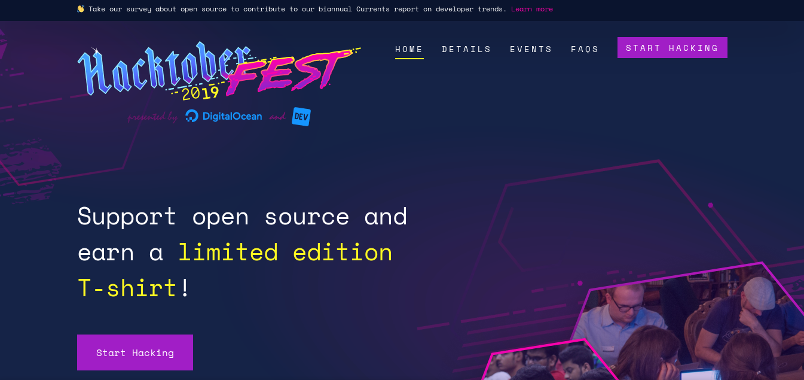
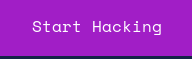
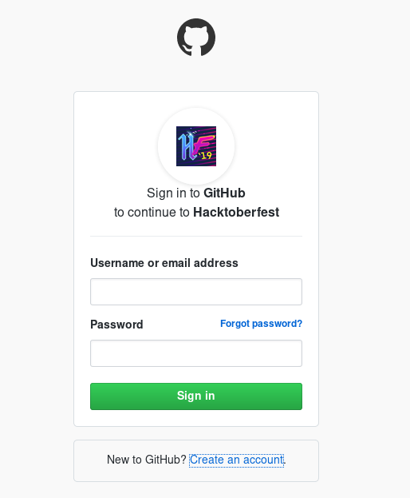
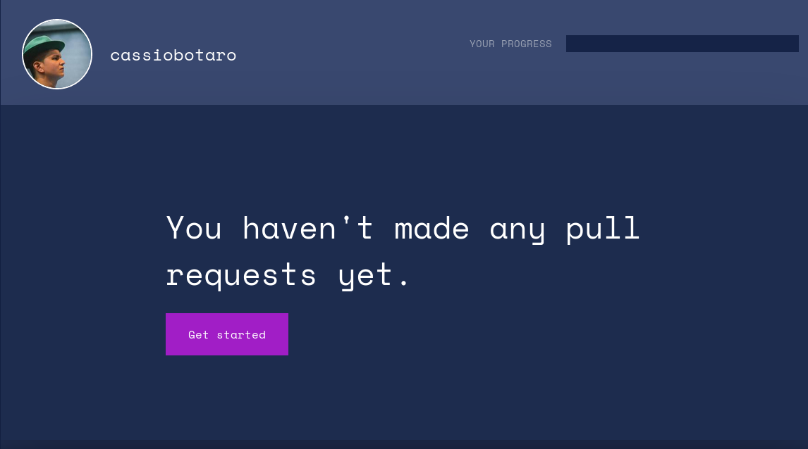

  

# Hacktoberfest

:octocat: Apoie o open source e ganhe uma camisa exclusiva!

## Vocabulário

Para te ajudar a não se perder nos termos técnicos utilizados, listamos algumas palavras chaves.

**hacktoberfest** - Evento que ocorre todos os anos para apoiar a contribuição em projetos open source. Algumas empresas se juntam e parabenizam com uma camisa exclusiva a quem contribui.

**pull request** - Também conhecido como "merge request", é quando você faz uma mudança em um código(de terceiros) e pede a autorização dos responsáveis pelo projeto para fazer a junção da sua mudança com a versão atual do mesmo.

## Como participar?

Entre em [https://hacktoberfest.digitalocean.com](https://hacktoberfest.digitalocean.com).

Clique no botão de "Start Hacking" para cadastrar seu perfil do github.

Será pedido que você autorize o [Github](https://github.com/) a monitorar sua conta, assim ele conseguirá contabilizar suas pull requests.

Não se preocupe que as permissões não envolvem publicações em seu nome ou monitoramento de projetos privados.

Assim que digitar seu usuário e senha do github você será redirecionado para seu perfil onde pode acompanhar seu progresso.

:tada: Parabens! Agora vamos começar a contribuir!
