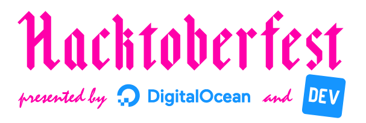

  

# Hacktoberfest

:octocat: Apoie o open source e ganhe uma camisa exclusiva!

Este guia foi criado pensando em ajudar a realizar as primeiras contribuições open source, em forma de um passo a passo a ser seguido.

Para facilitar a compreensão do guia, fizemos um [vocabulário](vocabulário.md) com algumas palavras menos comuns.

## Passo a passo

:tshirt: [Como Participar?](como-participar.md)

:package: [Nossa primeira contribuição.](contribuindo.md)

:trophy: [O desafio.](desafio.md)

:mag: [Procurando mais projetos para contribuir!](procurando.md)
