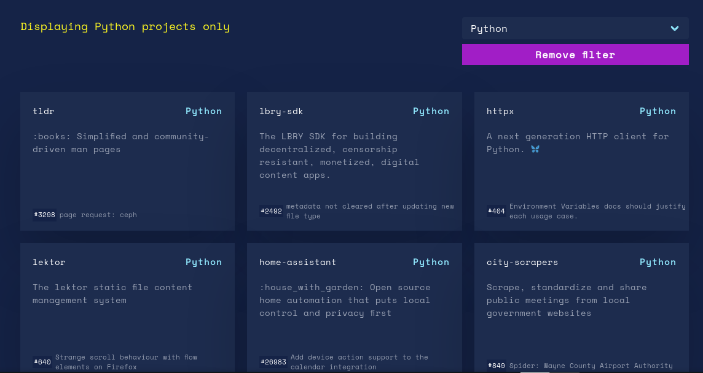
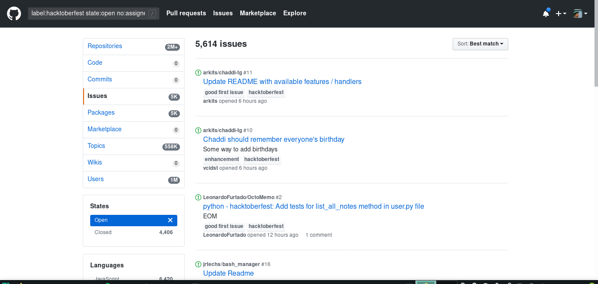
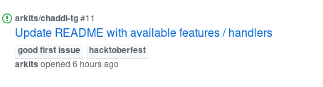

# :mag: Procurando mais projetos para contribuir!

:scream: E agora, como vou achar mais projetos para contribuir?

O site oficial da hacktoberfest possui uma [lista](https://hacktoberfest.digitalocean.com/#projects) com alguns projetos precisando de ajuda.

Fazendo uma [pesquisa](https://github.com/search?q=is%3Aopen+is%3Aissue+label%3AHacktoberfest+language%3Apython&state=open&type=Issues) no github, com a tag #hacktoberfest você também vai encontrar vários projetos legais.

Agora com ajuda dos mentores, vá nessas lista e procure mais projetos que você pode contribuir.

Caso esteja acompanhando este guia posteriormente, sinta-se a vontade para pedir ajuda através do nosso canal do telegram, @pythonmg.

:pushpin: Normalmente os problemas mais fáceis de resolver possuem a tag `good first issue`.

Uma outra opção é ajudar a aprimorar este guia, temos algumas ["*issues*"](https://github.com/pythonmg/hacktoberfest/issues) que estão em aberto.

Minha dica é: Procure projetos que te pareçam legal, fique de olho nas "*issues*" e nas "*pull requests*" do projeto. Uma contribuição de documentação tem tanta importância quanto uma funcionalidade nova. Veja como as pessoas resolvem os problemas que aparecem, utilize o projeto e se algo der errado, não deixe de reportar.

Outra dica é sempre ficar atento aos guias de como contribuir que alguns projetos possuem. Normalmente eles dizem como deve ser o estilo do código daquele projeto, ou validações necessárias antes de seu código seja mesclado.

Não se sinta intimidado quando outra pessoa revisar seu "*pull request*" e pedir alguma alteração, pelo contrário, encare isto como aprendizado.

:checkered_flag: É isto pessoal! Keep Hacking!

[:arrow_left: Nossa primeira contribuição](contribuindo.md)

[:leftwards_arrow_with_hook: Voltar ao README ](README.md)
